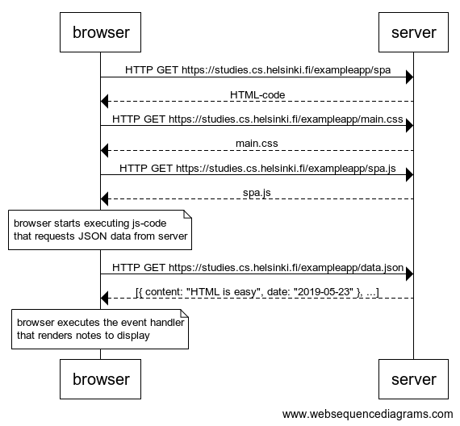

# Solutions

## 0.4: New note


```
note over browser:
user clicks on the Save button
and browser executes a POST request
with the given payload
end note

browser->server: HTTP POST https://studies.cs.helsinki.fi/exampleapp/new_note with Form Data note=input

note over server:
server saves the sent note
and answers with a redirect
end note

server-->browser: Status 302 and redirect to /notes

browser->server: HTTP GET https://studies.cs.helsinki.fi/exampleapp/notes
server-->browser: HTML-code
browser->server: HTTP GET https://studies.cs.helsinki.fi/exampleapp/main.css
server-->browser: main.css
browser->server: HTTP GET https://studies.cs.helsinki.fi/exampleapp/main.js
server-->browser: main.js

note over browser:
browser starts executing js-code
that requests JSON data from server 
end note

browser->server: HTTP GET https://studies.cs.helsinki.fi/exampleapp/data.json
server-->browser: [{ content: "HTML is easy", date: "2019-05-23" }, ...]

note over browser:
browser executes the event handler
that renders notes to display
end note
```

## 0.5: Single page app



```
browser->server: HTTP GET https://studies.cs.helsinki.fi/exampleapp/spa
server-->browser: HTML-code
browser->server: HTTP GET https://studies.cs.helsinki.fi/exampleapp/main.css
server-->browser: main.css
browser->server: HTTP GET https://studies.cs.helsinki.fi/exampleapp/spa.js
server-->browser: spa.js

note over browser:
browser starts executing js-code
that requests JSON data from server 
end note

browser->server: HTTP GET https://studies.cs.helsinki.fi/exampleapp/data.json
server-->browser: [{ content: "HTML is easy", date: "2019-05-23" }, ...]

note over browser:
browser executes the event handler
that renders notes to display
end note
```

## 0.6: New note SPA


```
note over browser:
user clicks on the Save button
and browser executes a POST request
with the given JSON payload
{ content: "HTML is easy", date: "2019-05-23" }
end note

browser->server: HTTP POST https://studies.cs.helsinki.fi/exampleapp/new_note_spa with JSON body

note over server:
server saves the sent note
and answers with a JSON body
end note

server-->browser: Status 201 and body {"message":"note created"}

note over browser:
the browser handles the response
and displays the result via the
SPA framework
end note
```
